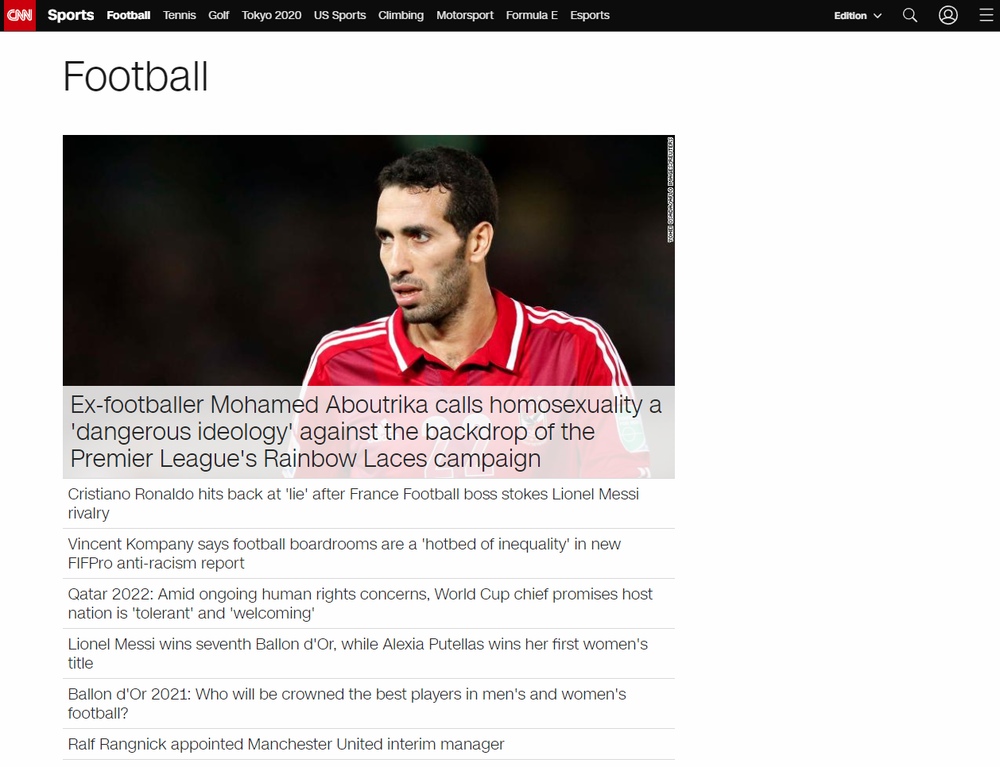
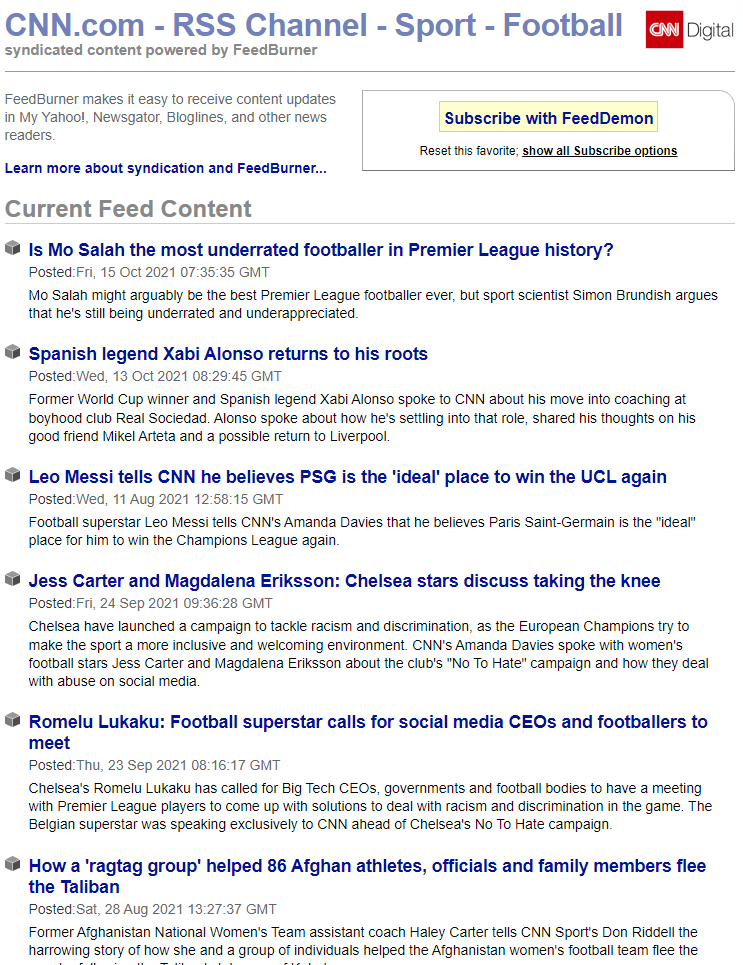
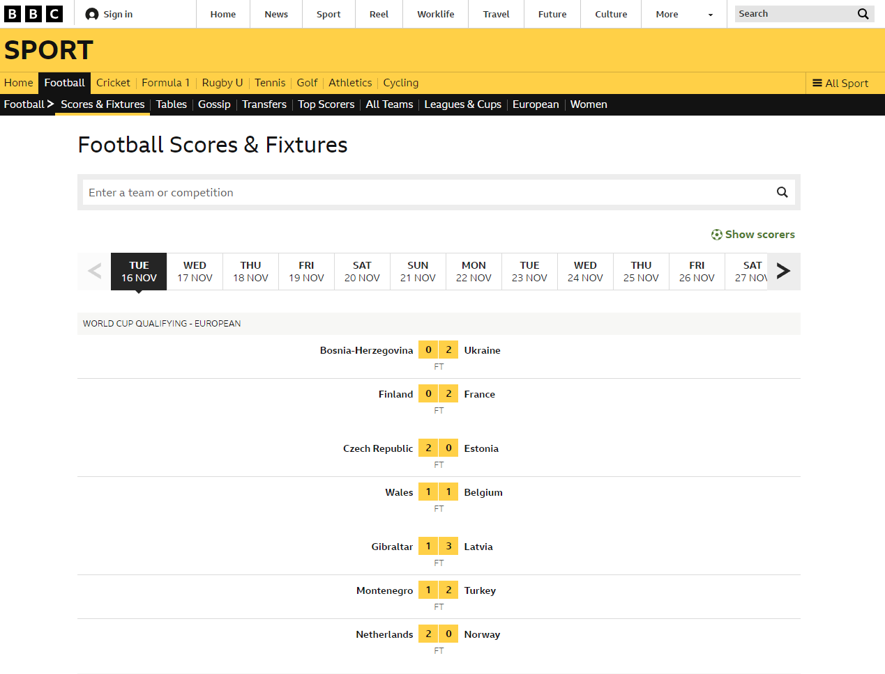
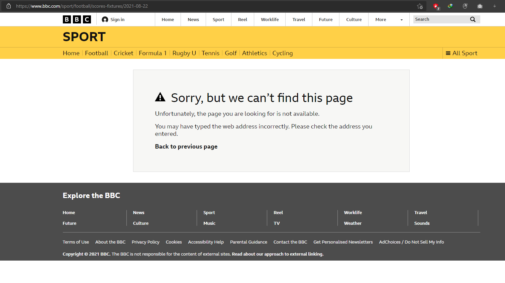
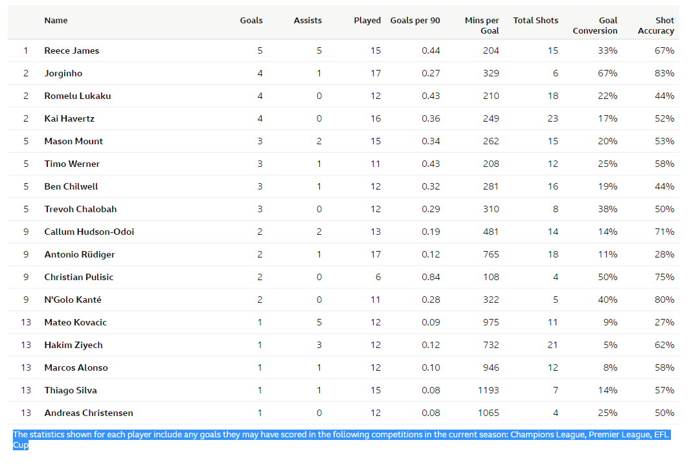

Data Scraping on Sports Website
==============================
This is a submission of **assignment 2** for the **CIS711** course.

It contains the code necessary to scrape data from a well-known sports website.

This repository is merely a demonstration of how web scraping performs.

Getting Started
------------
Clone the project from GitHub

`$ git clone https://github.com/tariqshaban/sports-data-scraper.git`

Install numpy
`pip install numpy`

Install pandas
`pip install pandas`

install matplotlib
`pip install matplotlib.pyplot`

Install scipy
`pip install scipy`

Install calplot
`pip install calplot`

Install requests
`pip install requests`

Install beautiful soup
`pip install bs4`

You may need to configure the Python interpreter (depending on the used IDE)

No further configuration is required.

Project Structure
------------
    ├── README.md                 <- The top-level README for developers using this project.
    │
    ├── helpers
    │   ├── date_time_handler     <- Set of static methods that aid some time manipulations
    │   └── progress_handler      <- Set of static methods that aid some progress manipulations
    │
    ├── models
    │   ├── league                <- A container for storing league URL as well as league name.
    │   └── club                  <- A container for storing club id as well as the club name
    │
    ├── providers
    │   ├── plots_provider        <- Static methods which perform the plotting functionality
    │   └── sports_scraper        <- Static methods which perform the scraping functionality
    │
    └── main                      <- Acts as a sandbox for methods invocation

Report / Findings
------------
### What tools have been used to scrape data off the web?

Beautiful Soup has been used for scraping; it contains abstract out-of-the-box methods that help extract information
from the HTML file.

> Beautiful Soup is a Python library for pulling
> data out of HTML and XML files. It works with your
> favorite parser to provide idiomatic ways of navigating,
> searching, and modifying the parse tree.
> It commonly saves programmers hours or days of work.

There were no modifications committed for this scraping tool since it already satisfies the required objectives.

### What were the target websites?

Primarily [ESPN](https://www.espn.in/)

### Why haven't you used the provided website (CNN Sports)?!

While [CNN Sports](https://edition.cnn.com/sport) is considered an excellent candidate for scraping, it only contains
data about the news itself (Title, images, date of release, content) rather than showing a list of players, etc.

  
Click here to view the full alibi

--------

#### Rejecting CNN Sports

CNN Sports only provide data concerning news; it does not provide any type of semi-structured data in which it can be
capitalized and used to extract the required information.

CNN Sports appears to have an RSS (Really Simple Syndication) feed, but it had the same issues as mentioned above.

#### Rejecting BBC Sports

BBC Sports actually contained some highly relevant data; however, the time interval for the data does not even stretch
for more than a month.

Modifying the date manually through the URL did not help.

Also, BBC Sports did not provide a wide collection of leagues; only several leagues were mentioned.

Overall, scraping from BBC Sports will not yield sufficient data for analysis; since the time interval and the number of
leagues are very limited, as well as if did not provide additional data, such as the physical status of the players.

--------

### What information did you extract?

We successfully collected information of the following:

* Players
    * Name
    * Number
    * Position
    * Physical Status
    * Matches Stats (total goals, fouls, etc.)
* Leagues
    * League Name
    * League URL (for future scraping purposes)
* Clubs
    * League Name
    * Club Name
* Matches
    * Elapsed Matches
        * Opponents
        * Result
        * Location
        * Attendance
    * Fixtures
        * Opponents
        * Time
        * TV Channel
        
### What manipulations have you made for the data?

* Players
    * Column datatype conversion
    * Replaced blank spaces/empty values with nulls
    * Replaced double dashes with nulls
    * Converted weight from lbs to kg
    * Converted height from ft to meters
* Leagues
    * None
* Clubs
    * None
* Matches
    * Column datatype conversion
    * Replaced blank spaces/empty values with nulls
    * Replaced double dashes with nulls
    * Dropped rows that contained less than three non-null values

### What is the difference between collecting data via data scraping and using APIs?

Collecting data via **scraping** allows extracting information from web pages, and then manually filtering
the needed information

Collecting data via **APIs** allows direct access to the required data

It is highly recommended to use APIs rather than scraping for the following reasons:
* APIs provide instant data access while scraping requires traversing through multiple webpages
  (which is resource exhausting)
* APIs are much less liable to breaking changes while changing an HTML element class will break the scraping process
* APIs usually include thorough documentation and follows best practices and conventions
* Web scraping might be illegal under certain circumstances
* Most websites try to detect and limit/block web scraping

Use web scraping only when:
* The website does not provide a dedicated API
* The API is either private or requires an access token/key that cannot be acquired
* The data required is not spanned within the API

###  Give an example of using an API

Refer to `__get_clubs()` method within `sports_scrapper.py`, it sends an HTTP GET request to
`http://site.api.espn.com/apis/site/v2/sports/soccer/{league}/teams`,
where {league} is the league codename (for instance `ENG.1`)

### What illustrations have you made?
***TBA***

### What experiments have you conducted?

***TBA***

### What hypothesis have you formulated?

***TBA***

--------